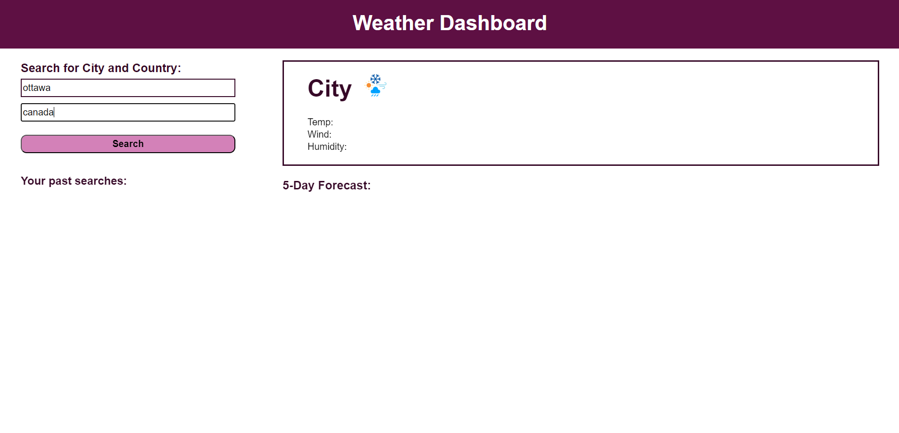

# Weather-Dashboard

## Description
This is an application that shows weather conditions for the current day and the next five days.  
It requires users to input the city and country of which they want to see the weather.  

It uses two API endpoints from openweathermap.org

## Installation 
N/A

## Usage
To use the Weather Dashboard you can click on the link below.

[Weather Dashboard - Sonja Gorin](http://sonjagorin.github.io/Weather-Dashboard)

Page preview:

## Credits
N/A

## License
Please refer to the LICENSE in the repo.
